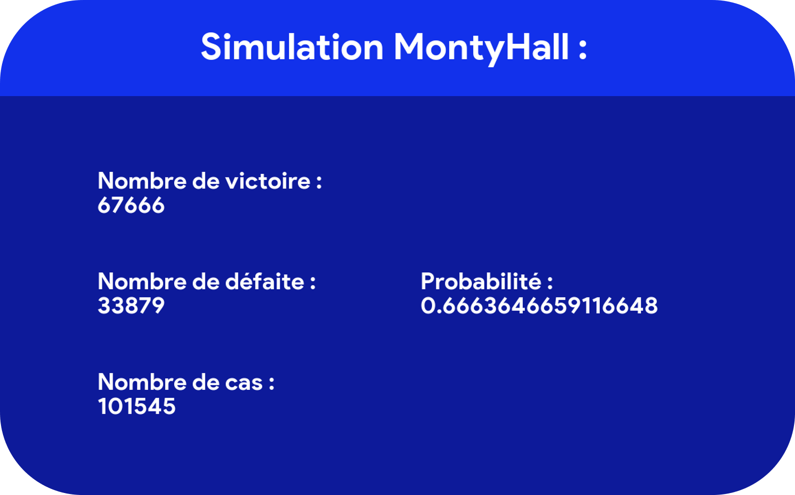

## ▶️ Le paradoxe de Monty Hall
Le paradoxe de Monty Hall est un problème probabiliste établi par Steve Selvin. Monty Hall vient du nom du présentateur du jeu télévisé "Let's Make a Deal" qui a inspiré la création de ce problème.

### Le concept en lui-même

Imaginons que le présentateur Monty Hall nous place devant trois portes, où se trouvent derrière l'un d'entre elle une voiture et derrière les deux autres une chèvre. Si on réussit à choisir la porte où il y a la voiture, on remporte ce prix.

### Le déroulement

<ul>
<li>Tout d'abord, il nous demande de choisir l'une des trois portes situées devant nous.</li>
<li>Ensuite, après l'avoir choisi, Monty Hall va ouvrir l'une des portes où se situe une chèvre (sans bien évidemment ouvrir notre porte choisie)</li>
<li>Enfin, il nous demande si on veut modifier notre choix pour essayer d'améliorer nos chances.</li>
</ul>

La question est donc: <b>Devrions-nous garder notre choix ou choisir la dernière porte qui reste ?</b>

La plupart d'entre nous, répondraient à cette question de la manière suivante: "les probabilités sont les mêmes, donc peu importe"
Et bien aussi curieux que cela puisse paraître, nous aurions faux de dire ça. En effet, la probabilité que l'on gagne la voiture en ne changeant pas de porte (1/3) est inférieure au scénario où l'on change de porte (2/3). Cela peut se démontrer de plusieurs façons, soit avec la formule des probabilités totales ou soit avec le théorème de Bayes.

### L'objectif du fichier python

Ce programme a pour but de simuler ce jeu, selon les instructions que l'on lui donne (changer ou non de porte à la phase 2) et ainsi calculer et vérifier la probabilité de remporter la voiture.

## ▶️ Monty Hall's paradox
The Monty Hall paradox is a probabilistic problem established by Steve Selvin. Monty Hall comes from the name of the presenter of the game show "Let's Make a Deal" who inspired the creation of this problem.

### The concept itself
Let's imagine that presenter Monty Hall puts us in front of three doors, where behind one of them is a car and behind the other two is a goat. If we manage to choose the door with the car behind it, we win that award.

### The sequence of events
<ul><li>First, he asks us to choose one of the three doors in front of us.</li>
<li>Then, after choosing it, Monty Hall will open one of the doors where a goat is located (without of course opening our chosen door).</li>
<li>Finally, he asks us if we want to change our choice to try to improve our chances.</li></ul>

So the question is: Should we keep our choice or pick the last remaining door?

Most of us would answer this question in the following way: "the probabilities are the same, so it doesn't matter". And as curious as it may seem, we would be wrong to say that. Indeed, the probability that we win the car by not changing doors (1/3) is lower than the scenario where we change doors (2/3). This can be demonstrated in several ways, either with the total probability formula or with Bayes' theorem.

### The purpose of the python file
The aim of this program is to simulate this game, according to the instructions given (to change or not to change the door in phase 2) and thus to calculate and check the probability of winning the car.

