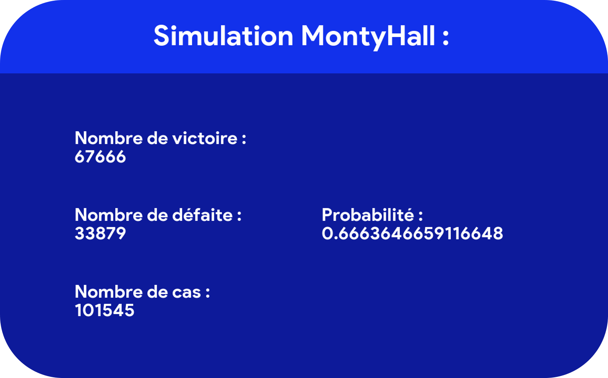

## Le paradoxe de Monty Hall
Le paradoxe de Monty Hall est un problème probabiliste établi par Steve Selvin. Monty Hall vient du nom du présentateur du jeu télévisé "Let's Make a Deal" qui a inspiré la création de ce problème.

### Le concept en lui-même

Imaginons que le présentateur Monty Hall nous place devant trois portes, où se trouvent derrière l'un d'entre elle une voiture et derrière les deux autres une chèvre. Si on réussit à choisir la porte où il y a la voiture, on remporte ce prix.

### Le déroulement

Tout d'abord, il nous demande de choisir l'une des trois portes situées devant nous
Ensuite, après l'avoir choisi, Monty Hall va ouvrir l'une des portes où se situe une chèvre (sans bien évidemment ouvrir notre porte choisie)
Enfin, il nous demande si on veut modifier notre choix pour essayer d'améliorer nos chances.

La question est donc: <b>Devrions-nous garder notre choix ou choisir la dernière porte qui reste ?</b>

La plupart d'entre nous, répondront à cette question de la manière suivante: "les probabilités sont les mêmes, donc peu importe"
Et bien aussi curieux que cela puisse paraître, nous aurions faux de dire ça. En effet, la probabilité que l'on gagne la voiture en ne changeant pas de porte (1/3) est inférieure au scénario où l'on change de porte (2/3). Cela peut se démontrer de plusieurs façons, soit avec la formule des probabilités totales ou soit avec le théorème de Bayes.

### L'objectif du fichier python

Ce programme a pour but de simuler ce jeu, selon les instructions que l'on lui donne (changer ou non de porte à la phase 2) et ainsi calculer et vérifier la probabilité de remporter la voiture.

